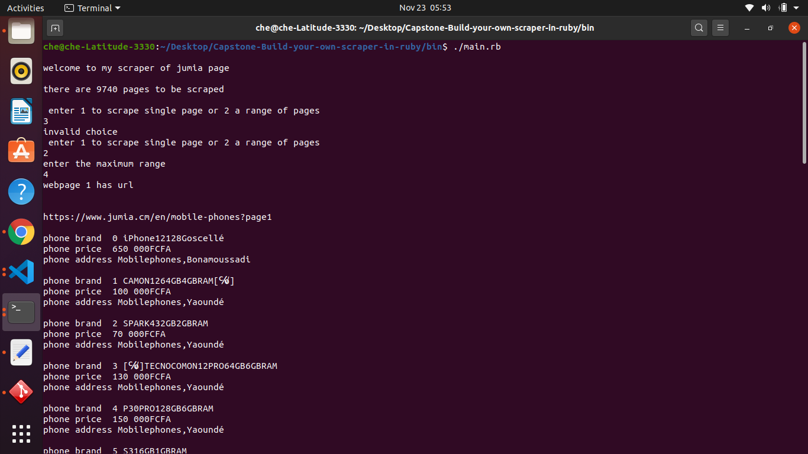

# Capstone-Build-your-own-scraper-in-ruby
# A web scraper
A web scraper is software used to collect information from the web
# About the project
I created this basic web scraper to get information about products in an e-commerce website. I used https://www.jumia.cm/en/mobile-phones?page2 for this project. The project has a basic interface that runs at the terminal 

# Goals of the project
The goals of this project are to Show mastery in :
- OOP (Object Oriented Programming) using Ruby.
- Create and structure a Ruby project from previous knowledge.
- Managing the files with correct usage to make ensure code maintainability.
- Git Flow and Github Flow creating branches for different features and for version control.
- Rspec for testing parts of the code.
## Getting started
To get a local copy up and running follow these simple example steps.

# Prerequisites
- For computers running on Linux, Mac OS, Unix follow this link https://www.ruby-lang.org/en/documentation/installation/  to install ruby if not already installed
-  For computers running windows use this link to install ruby if not yet installed https://www.ruby-lang.org/en/downloads/
-For all platforms, you must have a git set up locally
# Installation
- If you are in windows you can download or clone the repository.
- If u are in Linux, mac os, etc clone the repository by typing git clone git@github.com:che30/Capstone-Build-your-own-scraper-in-ruby.git

# Running the scraper
Open the terminal and install bundler by typing the command gem install bundler on the terminal. After installing bundler, navigate(change directory) to the folder containing the files you've cloned and typed the command bundle install on the terminal to install the necessary gems to run the scraper.

You will need to execute the scraper file located inside the bin folder. If you are using Window, follow the next step.

Windows
Open the terminal and navigate to the folder using cd path-to-folder containing the scraper files. Once you are inside, your terminal should look like this: User//scraper/. You can type or paste this on the terminal bin/scraper.rb to run the program.

Mac and Linux
navigate to the bin folder and execute the command ./main.rb on the terminal to have the scraper running

## Built With

- Ruby,
- Visual Studio Code, Git, and Github.

## Author

👤 **Che Blanchard**

- GitHub: [@che30](https://github.com/che30)
- Twitter: [@BlanchardNsoh](https://twitter.com/che55085128 )
- LinkedIn: [Che Blanchard](https://www.linkedin.com/in/che-nsoh-9455271b0/)

## 🤝 Contributing

Contributions, issues, and feature requests are welcome!

Feel free to check the [issues page](issues/).

## Show your support

Give an ⭐️ if you like this project!